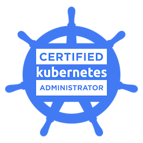

# Certified Kuberentes Administartor (CKA) 

  

 
 
A curated collection of exercises to help prepare for the Certified Kubernetes Security Specialist. The exercises have been segregated into their respective domains as per the [CNCF curriculum](https://training.linuxfoundation.org/certification/certified-kubernetes-administrator-cka/) for CKS. 
>
    Note: Regardless of you sitting the CKA exam or not, once you have completed most of the exercises, you will have a good understanding and implementation of security in the large Kubernetes eco-system. What matters is that you enjoy the learning process. Goodluck on your learning journey!

# Exam Domains

| No | Document Link |
| ------ | ------ |
| 1 | [Kubernetes Architecture][PlDa] |
| 2 | [Cluster Setup][PlDb] |
| 3 | [Scheduler ][PlDc]

   [PlDa]: <https://github.com/piyushgour/kubernetes-CKA/blob/main/Architecture_of_Cluster.md>
   [PlDb]: <https://github.com/piyushgour/kubernetes-CKA/tree/main/Cluster_create>
   [PlDc]: <https://github.com/piyushgour/kubernetes-CKA/tree/main/Scheduler>

